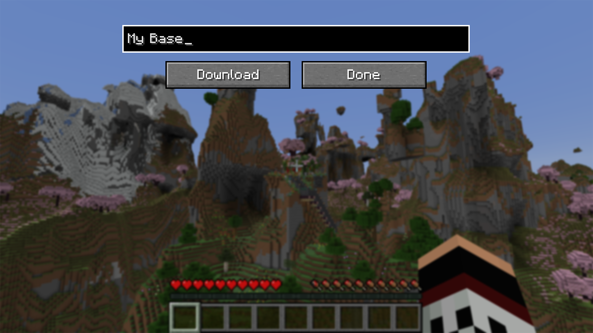
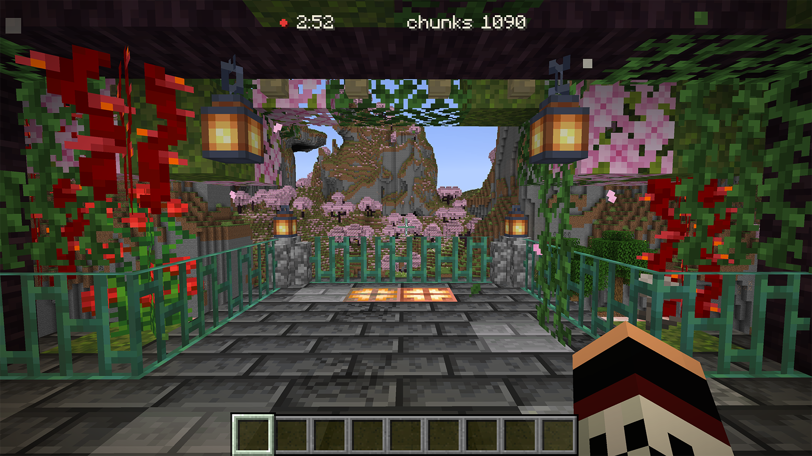
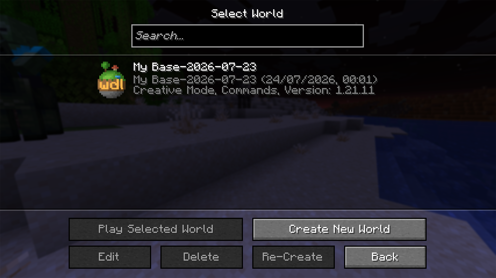

Save your first world from a multiplayer server and open your copy in singleplayer, in about five minutes. Follow the steps in order. This assumes the mod is already installed; if it is not, start with [Install](/get-started/install/).

## Connect to a server

Join a multiplayer server the way you normally do. Downloads work on a multiplayer server, so joining one is what makes the download button appear. Everything you save comes from your own game, so nothing runs on the server.

## Open the downloads screen

Open the pause menu with Esc. Click **"Download This World"**. That opens the downloads screen. It does not start the download by itself; that happens in the next step.

## Name and start the download

On the downloads screen, type a name for this world in the name field, then click **"Download"**. Naming it after the server is a good way to find it later. The screen closes and the download begins.

Chat does the same. `/wdl start <name>` starts a new download under the name you choose (see [Commands and keybinds](/reference/commands/) for the full list).

A download grows as you explore, taking roughly the disk space of an ordinary singleplayer world covering the same area. There is no free-space check before it starts, so if your disk is nearly full, clear some room first; running out partway is covered in [when a download fails](/guides/download-failed/).

## Play, and open the containers you want saved

Now play. Walk through the areas you want to keep, so the mod loads and saves the terrain around you as you go.

To save what is inside a container, open it. A Chest, Barrel, or other container has its contents saved the moment you open it, so open the ones whose contents you want in your copy.

A Lectern counts as a container too: open it to read, and its book is saved. A Chiseled Bookshelf works differently, because it opens no screen at all. [Check what you actually saved](/guides/check-coverage/) covers it, and shows how the mod outlines whatever is still missing.

The HUD shows the download progressing while you explore.

## Stop the download

When you have saved what you want, open the pause menu again. The button now reads **"Stop Download"**. Click it, or run `/wdl stop`. The download finalizes and writes your world to disk.

With the default settings, the mod also writes a `.zip` copy of the finished world beside the saved folder, ready to share.

## Find your world

Leave the server and open Singleplayer. The new world is in the list under the name you gave the download, with the date added to it by default, so downloads made on different days sit side by side. Open it like any other world and explore your copy.

Inside the world folder, a `wdl/` directory holds a `download.md` file: a plain-text manifest of what the download saved. The `.zip` copy sits alongside the world folder.
