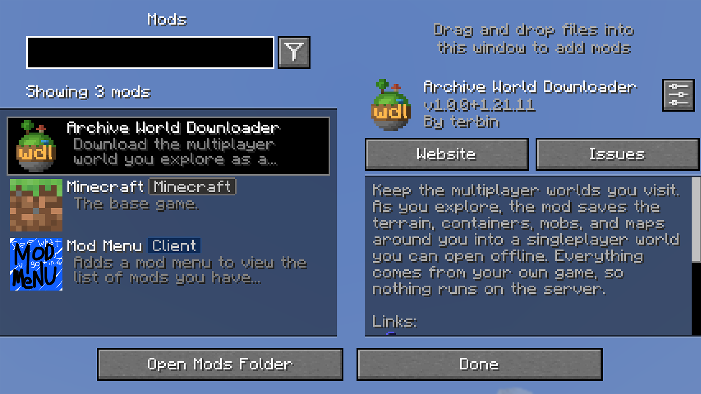

import { Tabs, TabItem, Steps, Aside } from '@astrojs/starlight/components';

<Aside type="caution" title="Not on Modrinth yet">
Archive World Downloader is on CurseForge now. Its Modrinth page has not cleared review yet, so you will not find the mod on Modrinth, and the Modrinth links on this page will not work until it does. Install from CurseForge for now, either the CurseForge App or Prism Launcher's CurseForge provider.
</Aside>

Archive World Downloader runs on Minecraft: Java Edition only. It runs on the client, so it installs on your own game and nothing runs on the server.

There are two routes, and you only need one: from inside a launcher with a built-in mod browser, or by hand into your `mods` folder.

## Install with a launcher

A launcher with a built-in mod browser installs the mod without you downloading a jar or touching a `mods` folder, and it installs the loader with it. Each set of mods lives in its own instance, so one for downloading worlds leaves the game you already play alone.

Pick the launcher you use. If you would rather install by hand, or you use a launcher that is not here, see [Install by hand](#install-by-hand).

<Tabs syncKey="launcher">
<TabItem label="Prism Launcher">

<Steps>

1. Click **Add Instance** on the top menu bar. On the **Custom** tab, choose your Minecraft version and your mod loader, give the instance a name, and create it.

   Prism installs Fabric and NeoForge from here. It does not install Quilt itself, and its wiki sends you to [Quilt's own instructions](https://quiltmc.org/install/prismlauncher/) for that.

2. Right-click the new instance and choose **Edit**. Open the **Mods** tab, then click **Download Mods** on the right.

3. Choose Modrinth or CurseForge as the provider on the left, search for Archive World Downloader, and click **Select mod for download**.

4. On Fabric, search for Fabric API in the same browser and select that too. Prism does not add a mod's dependencies for you, and its wiki tells you to check for Fabric API yourself. On Quilt, take Quilted Fabric API instead.

5. Click **OK**. Selecting a mod only queues it; OK is what downloads it.

6. Back on the **Mods** tab, both mods are listed with their names and versions. That tab is the instance's `mods` folder, so what you see there is what the instance will load.

</Steps>

Prism's own guide is [Downloading mods](https://prismlauncher.org/wiki/getting-started/download-mods/).

</TabItem>
<TabItem label="Modrinth App">

<Steps>

1. On the **Library** page, create a new instance. The dialog asks for the Minecraft version and the mod loader.

2. Go to the **Browse** page and search for Archive World Downloader.

3. Click **Add to instance** and choose the instance you just made. The mod is one project carrying its Fabric, NeoForge, and Quilt builds together, and the app selects the file that matches your instance.

4. Fabric API arrives with it. The app installs the dependencies a mod requires.

5. Open the instance and look at its **Content** tab. Both mods are listed there, each with a switch to turn it off without deleting it.

</Steps>

To change an instance's loader or Minecraft version later, open its settings and use the **Installation** tab. That tab also has a **Repair** button, which is Modrinth's remedy for an instance that will not start.

Modrinth's own help centre covers [mod loaders and game versions](https://support.modrinth.com/en/articles/8827653-installing-updating-mod-loaders-and-game-versions).

</TabItem>
<TabItem label="CurseForge App">

<Steps>

1. Open the Minecraft section and click **Create**. Name the profile, pick a Minecraft version, and pick the modloader. The latest version of that loader is chosen for you.

2. Search for Archive World Downloader and click **Install**. The app asks whether to add it to an existing profile or make a new one. A new profile takes its Minecraft version and loader from the mod's file.

3. Fabric API comes down with the Fabric build, because the app downloads a file's required libraries alongside it.

4. To add anything else to the profile afterwards, use **Add More Content** on the profile rather than the mod's Install button.

5. The profile's **Installed Mods** section lists what is in it, with a switch for each. Click **Play** to start the game.

</Steps>

CurseForge builds a profile around every mod, so a single mod still gives you something that looks like a modpack. Two things catch people out. A mod and the profile have to use the same modloader, or the app refuses the install and marks the profile incompatible. And a profile you got by downloading someone's modpack will not take new mods until you open **Profile Options** and tick **Allow content management for this profile**, which stops that pack from updating for as long as it is ticked.

CurseForge's own guide is [Installing Minecraft mods and modpacks](https://support.curseforge.com/support/solutions/articles/9000196984-installing-minecraft-mods-and-modpacks).

</TabItem>
</Tabs>

## Install by hand

If you installed with a launcher above, skip to [Java](#java). Without a launcher's mod browser you fetch the build yourself and put it in the `mods` folder. Work through the steps in order for the loader you already run.

### Pick your build

Get the mod from its [Modrinth](https://modrinth.com/mod/wdl) or [CurseForge](https://www.curseforge.com/minecraft/mc-mods/wdl) page, and choose the build that matches your Minecraft version and loader. Each build lists the exact dependency versions it needs, so take those versions straight from the page.

### Install the loader and dependencies

Install the loader and dependencies for the build you picked.

#### Fabric

Install Fabric Loader for your Minecraft version. The mod also needs Fabric API. Download the Fabric API version the Modrinth page lists for your build and keep it with the mod.

#### NeoForge

Install NeoForge for your Minecraft version. It needs no extra library.

#### Quilt

Quilt runs the Fabric build. On Quilt, install the Fabric jar of the mod together with Fabric API. Quilt reads Fabric mods directly, so there is no separate Quilt build.

### Add the jars to your mods folder

Put the downloaded jars in the `mods` folder inside your Minecraft game directory. On Fabric and Quilt that is the mod jar and the Fabric API jar. On NeoForge it is the mod jar on its own. Create the `mods` folder if it is not there yet.

## Java

Current Minecraft versions need Java 21, and the mod needs Java 21 or newer. Each of the three launchers can get it for you: the CurseForge App installs Java on its own, the Modrinth App has **Install recommended** next to "Java 21 location" in its Java installations settings, and Prism Launcher offers to autodetect and download Java when you first set it up. If you installed by hand, the official launcher installs Java 21 for you.

## Launch and confirm it loaded

A launcher's mod list, or a jar sitting in your `mods` folder, only tells you the file is in place. To confirm the game loaded it, start Minecraft from that instance or profile and look for Archive World Downloader by name in the in-game mod list: ModMenu on Fabric and Quilt, or the Mods screen on NeoForge. Seeing it there confirms it loaded.

For a definitive check, search the game log for `loaded on Minecraft`. The mod writes that line at startup and names your Minecraft version in it.

## You need a multiplayer server to download

Downloads only work while you are joined to a multiplayer server. In a singleplayer world, or a LAN world you host yourself, the pause menu has no download button. Starting one from the keybind or a `/wdl` command answers with a notice telling you to join a server. Join one, and the button appears in the pause menu.

A download can also start from a replay recorded with ReplayMod or Flashback, with no server connection at all. See [Download from a replay](/guides/replay-download/).

## If it does not load

If the mod is missing from both the in-game mod list and the log, the cause is usually one of these. On a launcher, the same causes apply when the mod is in the launcher's own list but not in the game's.

- The jar is for a different loader than the one you launched, or the instance runs a different loader than the build you added.
- A dependency is missing, most often Fabric API on Fabric or Quilt.
- The build does not match your Minecraft version.

The fix is the same for all three. Go back to the Modrinth version selector and download the build, and its dependencies, for your exact Minecraft version and loader.

Once it loads, go on to [Your first download](/get-started/first-download/).
